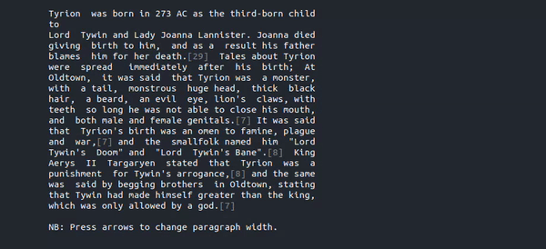
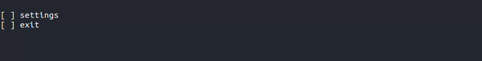
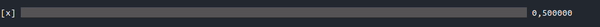
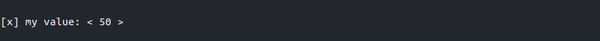
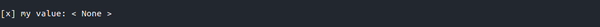
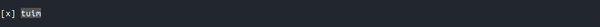

# tuim

[](https://opensource.org/licenses/MIT)
[](https://github.com/xorrad/tuim/issues)
[](https://github.com/xorrad/tuim)

An header-only immediate mode text-based user interface for terminals.

## Table of Contents

- [Installation](#installation)
- [Features](#features)
- [Examples](#examples)
- [Contributing](#contributing)
- [License](#license)

## Installation

Download the header file: [tuim.hpp](https://raw.githubusercontent.com/Xorrad/nage/master/tuim.hpp), then include it into your project and initialize and free *tuim* as in the following example:

```cpp
#include "tuim.hpp"

int main() {
    tuim::init();
    // your code...
    tuim::delete_context();
    return 0;
}
```

## Features

### Text

```cpp
tuim::print(fmt, ...);
```

```cpp
tuim::text(id, str);
```
<small><i>Note: use `tuim::print` if no id needed.</i></small>

### Paragraph

```cpp
tuim::paragraph(id, text, width);
```


### Buttons

```cpp
bool is_pressed = tuim::button(id, text, flags);
```


### Sliders

```cpp
bool has_changed = tuim::slider<int>(id, &value, min, max, step);
```



### Inputs

#### Numbers
```cpp
bool has_changed = tuim::input_number<int>(id, "my value: <%d>", &value, min, max, step);
```


```cpp
bool has_changed = tuim::input_enum<my_enum>(id, "my value: < %s >", &value, max, labels);
```


```cpp
bool has_changed = tuim::input_bool(id, "my boolean: %s", &value, [optional] labels);
```

#### Texts
```cpp
bool has_changed = tuim::input_text(id, &value, default_value, flags);
```


Available flags:
- INPUT_TEXT_FLAGS_NONE
- INPUT_TEXT_FLAGS_NUMERIC_ONLY
- INPUT_TEXT_FLAGS_ALPHANUMERIC_ONLY
- INPUT_TEXT_ALLOW_LINE_BREAKS

### Misc

```cpp
tuim::hr(length);

tuim::new_line();
tuim::clear();
tuim::clear_line();
```

### Cursor

```cpp
tuim::vec2 pos = tuim::get_cursor();

tuim::gotoxy({x, y});

tuim::set_cursor_visible(false);
```

### Inline Style Tags

#### Inline Colors

Use `#` and `#_` to change the foreground and background color respectively:

```cpp
tuim::print("#ff0000Foreground");
tuim::print("#_ff0000Background");
```

You can add a semicolon after the color code for readability:

```cpp
tuim::print("#ff0000;Foreground");
```

#### Text Modes

- `&r` clear colors stack and reset color to default.  
- `&b` toggle bold style.
- `&d` toggle dim style.
- `&i` toggle italic style.
- `&u` toggle underlined style.
- `&g` toggle blinking style.
- `&n` toggle inverse style.
- `&h` toggle hidden style.
- `&s` toggle strikethrough style.

#### Custom Codes

```cpp
font::register_style("a", font::make_style(color::from_code("#ff0000")));
font::register_style("k", font::make_style(font::mode::BOLD));

tuim::print("&aGreen Foreground");
tuim::print("&_aGreen Background");
tuim::print("&kBold");
```


## Examples

There are a few examples available in the [examples](https://github.com/Xorrad/tuim/tree/master/examples) directory. Do not hesitate to check them to learn more about using predefined generators and making new ones.

## Contributing

Contributions to the project are highly appreciated! There are several ways to get involved: you can contribute by reporting any issues you encounter, suggesting new features that could enhance the project, or even by actively participating in the development process through the submission of pull requests.

## License

This project is licensed under the MIT License - see the [LICENSE](https://raw.githubusercontent.com/Xorrad/tuim/master/LICENSE) file for details.